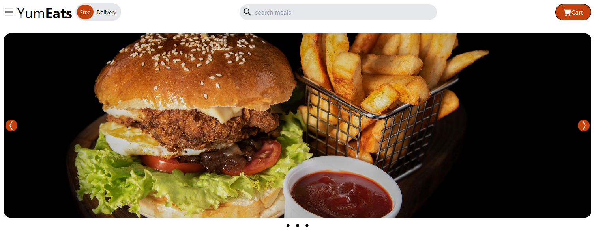
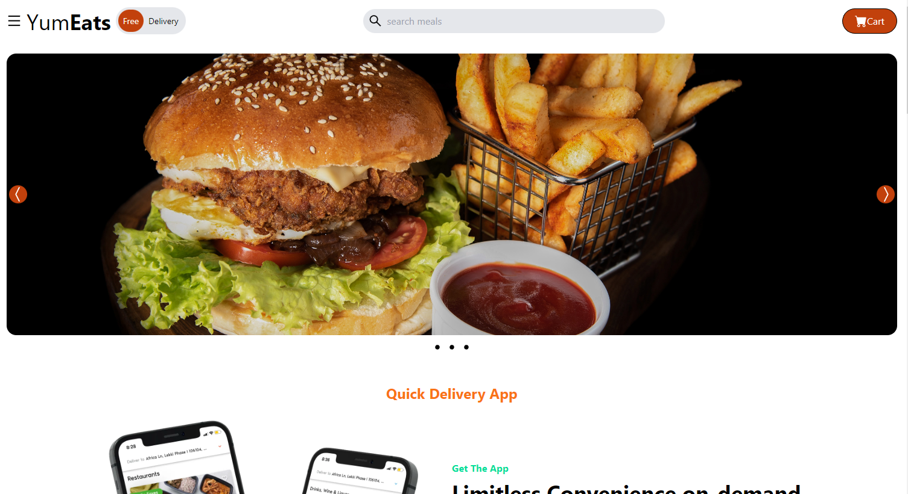
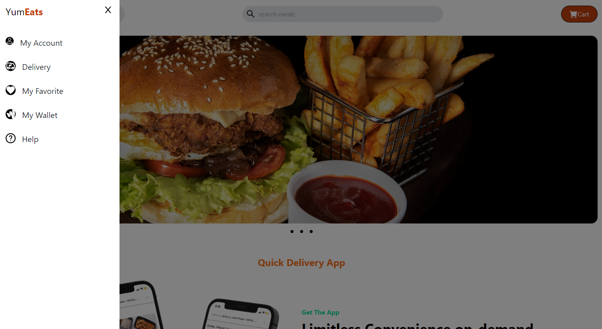
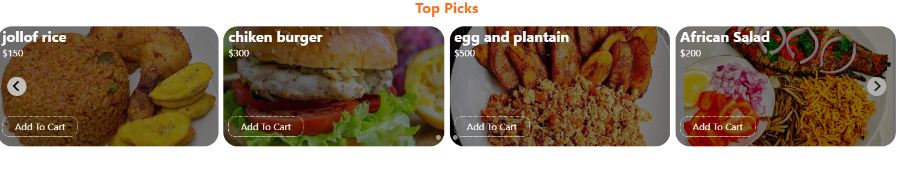
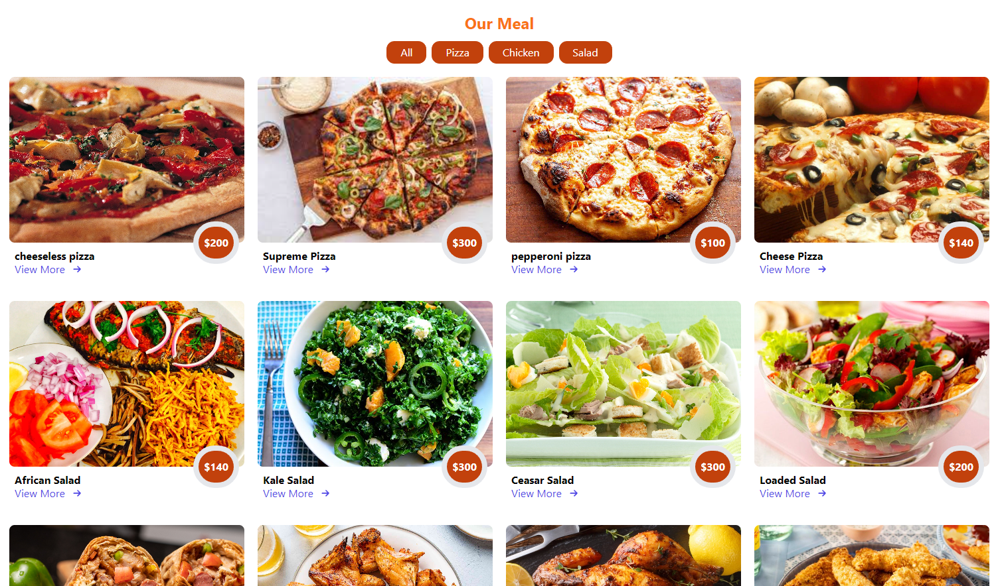
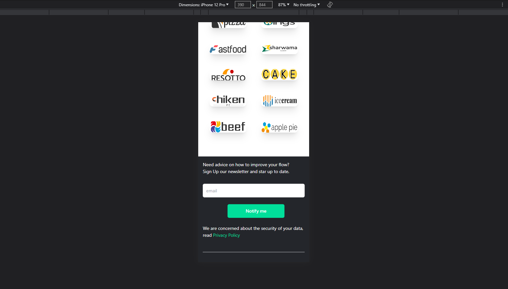

# YumEat Udemy project



This is a proyect from an udemy course about how to use React components to create a index web site for a food web site which includes:
- **The main page**
    - 
- **Side bar with a few elements**
    - 
- **gallery of image in carrousel**
    - 
- **Filter elements for  type of meal**
    - 
- **Responsive design**
    - 
- **Styled with tailwind**

For the instalations and cheking only need to clone this respository and type: 
```console
npm start
```

